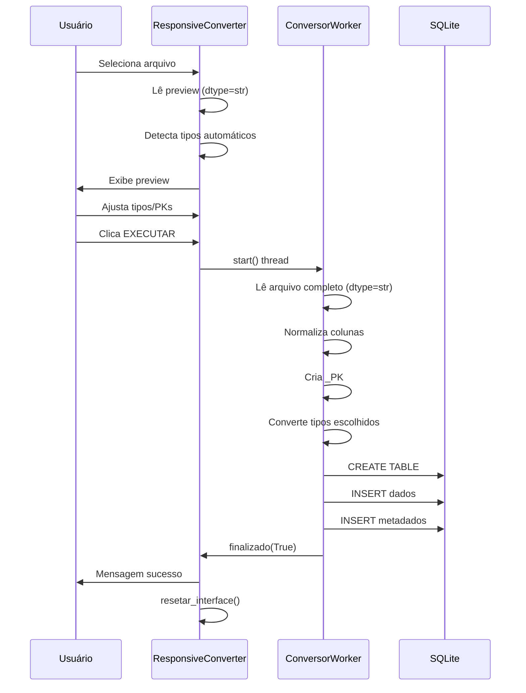
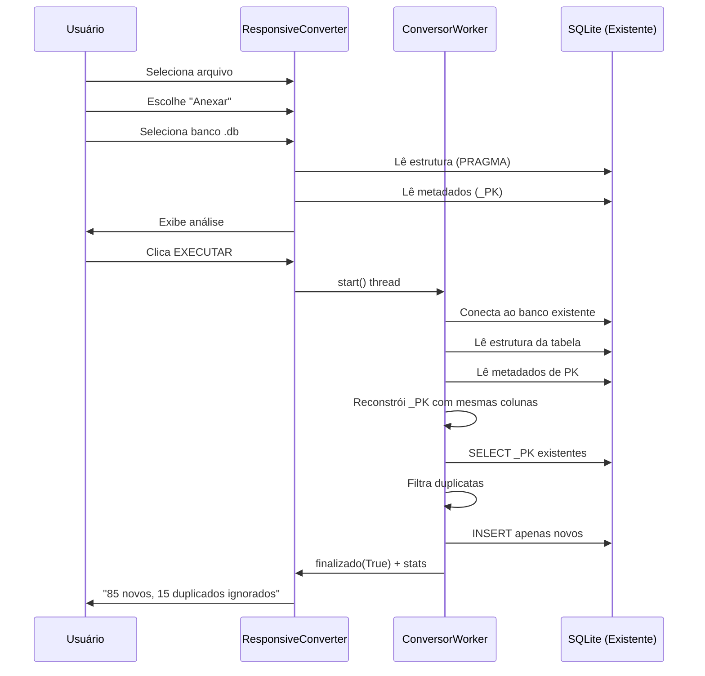

# Guia Técnico - DataForge Pro

## 📐 Arquitetura Detalhada

### 1. Padrão de Design: MVC com Threading

```
MODEL                    VIEW                    CONTROLLER
────────────────────────────────────────────────────────────
pandas.DataFrame  ←→  ResponsiveConverter  ←→  ConversorWorker
SQLite Database       (PySide6 Widgets)        (QThread)
Metadados PK          Progress Bar             Signals/Slots
```

### 2. Classes Principais

#### `ConversorWorker(QThread)`
**Responsabilidade**: Processamento assíncrono de conversão

**Atributos Principais**:
- `excel_path`: Caminho do arquivo fonte
- `db_path`: Caminho do banco de destino
- `modo`: 'replace' ou 'append'
- `tipo_mapeamento`: Dict[str, Dict[str, str]] - Tipos escolhidos pelo usuário
- `colunas_pk`: Dict[str, List[str]] - Colunas que formam PK
- `db_existente_path`: Caminho do banco existente (modo append)

**Signals**:
- `progresso(int)`: Emite percentual de conclusão (0-100)
- `status(str)`: Emite mensagens de log
- `finalizado(bool, str)`: Emite resultado (sucesso/falso, mensagem)

**Métodos Principais**:

```python
def run(self):
    """Método principal executado em thread separada"""
    # 1. Lê arquivo (dtype=str para preservar dados)
    # 2. Define caminho do banco (novo ou existente)
    # 3. Cria conexão SQLite com otimizações
    # 4. Cria tabela de metadados
    # 5. Para cada aba:
    #    - Normaliza nomes de colunas
    #    - Cria/reconstrói _PK
    #    - Verifica duplicatas (se append)
    #    - Converte tipos conforme escolha do usuário
    #    - Insere dados
    #    - Salva metadados
    # 6. Commit e fecha conexão

def obter_estrutura_tabela_existente(conn, nome_tabela):
    """Usa PRAGMA table_info() para ler schema"""
    # Retorna: (estrutura_dict, tem_pk_bool, lista_colunas)

def salvar_metadata_pk(conn, tabela, colunas_pk):
    """Persiste informação sobre colunas da PK"""
    # INSERT OR REPLACE em _dataforge_metadata

def obter_metadata_pk(conn, tabela):
    """Recupera quais colunas formam a PK"""
    # SELECT colunas_pk FROM _dataforge_metadata

def criar_coluna_pk(df, colunas_pk):
    """Cria coluna _PK concatenando valores"""
    # df['_PK'] = df[cols].agg('|'.join, axis=1)

def verificar_duplicatas(conn, tabela, df, coluna_pk):
    """Filtra registros já existentes"""
    # SELECT _PK FROM tabela → set
    # df_novo = df[~df._PK.isin(set)]

def converter_coluna_tipo(df, col_name, tipo):
    """Aplica conversão de tipo em coluna específica"""
    # INTEGER: pd.to_numeric + astype(int)
    # REAL: pd.to_numeric
    # BOOLEAN: map({true:1, false:0})

def converter_tipos_python_para_sqlite(df):
    """Converte tipos incompatíveis (Timestamp → str)"""
    # Detecta datetime64, timedelta64 → str
```

---

#### `ResponsiveConverter(QWidget)`
**Responsabilidade**: Interface gráfica e controle de fluxo

**Atributos Principais**:
- `excel_path`: Path do arquivo selecionado
- `db_path_existente`: Path do banco existente (append)
- `preview_data`: Dict com DataFrame preview
- `tipo_combos`: Dict[sheet][coluna] → QComboBox
- `pk_checkboxes`: Dict[sheet][coluna] → QCheckBox

**Métodos Principais**:

```python
def init_ui(self):
    """Constrói interface gráfica"""
    # Layout vertical com:
    # - Header (título + subtítulo)
    # - Card de seleção de arquivo
    # - Botão de guia de tipos
    # - Preview de dados (QTableWidget)
    # - Opções de modo (radio buttons)
    # - Seleção de banco existente (modo append)
    # - Console de logs (QPlainTextEdit)
    # - Progress bar
    # - Botão executar

def selecionar_excel(self):
    """Abre diálogo de arquivo"""
    # QFileDialog.getOpenFileName()
    # Chama carregar_preview()

def carregar_preview(filepath):
    """Lê primeiras 100 linhas como string"""
    # pd.read_excel/csv(dtype=str, nrows=100)
    # Chama mostrar_preview()

def mostrar_preview(df, sheet_name):
    """Preenche QTableWidget"""
    # Linha 1: ComboBox de tipos
    # Linha 2: CheckBox de PK
    # Linha 3: Texto explicativo
    # Linhas 4-7: Dados de exemplo

def selecionar_banco_existente(self):
    """Abre diálogo para selecionar .db"""
    # QFileDialog.getOpenFileName()
    # Chama analisar_banco_existente()

def analisar_banco_existente(self):
    """Lê estrutura do banco"""
    # SELECT name FROM sqlite_master
    # PRAGMA table_info() para cada tabela
    # Busca metadados em _dataforge_metadata
    # Exibe no console

def executar(self):
    """Inicia processamento"""
    # Valida seleções
    # Coleta tipos e PKs escolhidos
    # Cria ConversorWorker
    # Conecta signals
    # worker.start()

def concluir(sucesso, msg):
    """Callback de finalização"""
    # Exibe mensagem de sucesso/erro
    # Chama resetar_interface()

def resetar_interface(self):
    """Volta ao estado inicial"""
    # Limpa variáveis
    # Esconde preview
    # Limpa campos
    # Pronto para nova conversão
```

---

### 3. Esquema de Banco de Dados

#### Tabela de Dados (Exemplo)
```sql
CREATE TABLE "Sheet1" (
    "N_Documento" TEXT,
    "Material" TEXT,
    "Quantidade" INTEGER,
    "Preco_Unitario" REAL,
    "Data_Emissao" DATETIME,
    "_PK" TEXT
)
```

#### Tabela de Metadados (Sistema)
```sql
CREATE TABLE _dataforge_metadata (
    tabela TEXT PRIMARY KEY,
    colunas_pk TEXT,           -- CSV: "N_Documento,Material"
    data_criacao TEXT          -- ISO8601: "2024-02-10 14:30:00"
)
```

---

### 4. Fluxo de Dados Detalhado

#### Modo: Criar Novo Banco



#### Modo: Anexar a Banco Existente



---

### 5. Otimizações Implementadas

#### 5.1 Performance de I/O

**PRAGMA Configurations**:
```sql
PRAGMA synchronous = OFF;      
-- Desabilita fsync() após cada commit
-- Ganho: 5-10x mais rápido
-- Trade-off: Risco de corrupção se crash durante escrita

PRAGMA journal_mode = MEMORY;  
-- Journal em RAM ao invés de disco
-- Ganho: 2-3x mais rápido
-- Trade-off: Sem recovery em caso de crash
```

**Chunked Inserts**:
```python
# Ao invés de:
for row in df.iterrows():
    cursor.execute(INSERT, row)  # 1 operação por linha

# Usa:
cursor.executemany(INSERT, df.values)  # 1 operação para todas
```

#### 5.2 Performance de Leitura

**Engine Calamine** (Rust):
```python
# 10x mais rápido que openpyxl para .xlsx
xls = pd.ExcelFile(path, engine='calamine')
```

**dtype=str + Conversão Seletiva**:
```python
# Evita conversões automáticas do pandas
df = pd.read_excel(path, dtype=str)  # Tudo string

# Converte apenas onde necessário
if tipo == 'INTEGER':
    df[col] = pd.to_numeric(df[col])  # Conversão explícita
```

#### 5.3 Performance de UI

**Threading Assíncrono**:
```python
# UI Thread: ResponsiveConverter
# Worker Thread: ConversorWorker

# Evita freeze da interface
worker = ConversorWorker(...)
worker.progresso.connect(progress_bar.setValue)  # Signal/Slot
worker.start()  # Executa em background
```

---

### 6. Tratamento de Casos Especiais

#### 6.1 Dados Complexos

**Timestamps do Pandas**:
```python
# Problema: TypeError: type 'Timestamp' is not supported
# Solução:
if pd.api.types.is_datetime64_any_dtype(df[col]):
    df[col] = df[col].astype(str)  # "2024-02-10 14:30:00"
```

**IDs Longos**:
```python
# Problema: "2.626011023048e+43"
# Solução:
df = pd.read_excel(path, dtype=str)  # Preserva como string
# Usuário escolhe tipo TEXT → mantém original
```

**Zeros à Esquerda**:
```python
# Problema: "00123" → 123 (perda de zeros)
# Solução:
dtype=str mantém "00123"
```

#### 6.2 Colunas Problemáticas

**Caracteres Especiais**:
```python
import unicodedata

def normalizar_nome_coluna(nome):
    # "São Paulo" → "Sao Paulo"
    normalizado = unicodedata.normalize('NFKD', nome)
    normalizado = normalizado.encode('ASCII', 'ignore').decode('ASCII')
    
    # "Data de Nascimento" → "Data_de_Nascimento"
    normalizado = re.sub(r'\s+', '_', normalizado)
    
    # "Preço (R$)" → "Preco_R"
    normalizado = re.sub(r'[^a-zA-Z0-9_]', '', normalizado)
    
    return normalizado
```

#### 6.3 Duplicatas

**Cenário Complexo: PK em banco sem metadados**:
```python
# Problema: Não sabemos quais colunas formaram a _PK original
# Solução:
metadata = obter_metadata_pk(conn, tabela)
if metadata:
    # Usa colunas salvas
    colunas_pk = metadata.split(',')
else:
    # Aviso: metadados não disponíveis
    # Insere sem verificar (append sem controle)
    log("⚠ Metadados não encontrados - duplicatas não verificadas")
```

---

### 7. Diagrama de Estados

```
┌─────────────┐
│   INICIAL   │
└──────┬──────┘
       │ Seleciona arquivo
       ▼
┌─────────────┐
│   PREVIEW   │◄─────┐
└──────┬──────┘      │
       │             │ Seleciona novo arquivo
       │ Modo?       │
       ├─────────────┤
       │             │
  ┌────▼────┐   ┌───▼────┐
  │ REPLACE │   │ APPEND │
  └────┬────┘   └───┬────┘
       │            │ Seleciona banco
       │            ▼
       │      ┌──────────────┐
       │      │ BANCO EXIST. │
       │      └──────┬───────┘
       │             │
       └─────┬───────┘
             │ EXECUTAR
             ▼
       ┌──────────┐
       │PROCESSANDO│
       └─────┬────┘
             │
        ┌────┴────┐
    ┌───▼──┐  ┌──▼───┐
    │SUCESSO│ │ ERRO │
    └───┬──┘  └──┬───┘
        │        │
        └────┬───┘
             │ resetar_interface()
             ▼
       ┌─────────────┐
       │   INICIAL   │
       └─────────────┘
```

---

### 8. Testes Recomendados

#### Testes Unitários
```python
def test_normalizar_nome_coluna():
    assert normalizar("São Paulo") == "Sao_Paulo"
    assert normalizar("Preço (R$)") == "Preco_R"

def test_detectar_tipo_coluna():
    s = pd.Series(['1', '2', '3'])
    assert detectar_tipo_coluna(s) == 'INTEGER'
    
    s = pd.Series(['1.5', '2.3', '3.7'])
    assert detectar_tipo_coluna(s) == 'REAL'

def test_criar_coluna_pk():
    df = pd.DataFrame({
        'A': ['1', '2'],
        'B': ['x', 'y']
    })
    df, pk_col = criar_coluna_pk(df, ['A', 'B'])
    assert df['_PK'].tolist() == ['1|x', '2|y']
```

#### Testes de Integração
```python
def test_conversao_completa():
    # Cria arquivo Excel de teste
    # Executa conversão
    # Valida estrutura do banco
    # Valida dados inseridos
    # Valida metadados
    
def test_append_com_duplicatas():
    # Cria banco inicial com 100 registros
    # Anexa arquivo com 50 novos + 50 duplicados
    # Valida que apenas 50 foram inseridos
    # Valida que duplicatas foram logadas
```

---

### 9. Melhorias Futuras

#### 9.1 Performance
```python
# Processamento em streaming para arquivos grandes
def read_excel_chunks(path, chunksize=10000):
    for chunk in pd.read_excel(path, chunksize=chunksize):
        yield chunk

# Índices para acelerar verificação de duplicatas
CREATE INDEX idx_pk ON tabela(_PK)
```

#### 9.2 Funcionalidades
```python
# Validação de dados com regras customizadas
class Validacao:
    def validar_cpf(self, valor):
        # Regex + algoritmo de validação
        
    def validar_email(self, valor):
        # Regex email
        
# Transformações customizadas
def aplicar_transformacao(df, col, funcao):
    df[col] = df[col].apply(funcao)
```

#### 9.3 Monitoramento
```python
# Logging estruturado
import logging

logger = logging.getLogger('dataforge')
logger.info("Conversão iniciada", extra={
    'arquivo': path,
    'linhas': len(df),
    'tempo': elapsed
})

# Métricas
class Metrics:
    def __init__(self):
        self.tempo_leitura = 0
        self.tempo_conversao = 0
        self.tempo_insercao = 0
        self.duplicatas_ignoradas = 0
```

---

### 10. Troubleshooting

#### Problema: "MemoryError"
**Causa**: Arquivo muito grande para RAM  
**Solução**: Implementar chunking

#### Problema: "_PK não encontrada em modo append"
**Causa**: Banco criado em versão anterior sem metadados  
**Solução**: Recriar banco ou inserir metadados manualmente

#### Problema: "Tipos incompatíveis"
**Causa**: Conversão de string para número falhou  
**Solução**: Verificar dados de origem, usar TEXT se incerto

---

## 🔍 Conclusão

O DataForge Pro demonstra:
- **Arquitetura sólida**: MVC + Threading
- **Performance otimizada**: PRAGMA + Calamine + Chunking
- **Robustez**: Tratamento de casos especiais
- **Manutenibilidade**: Código modular e documentado
- **Escalabilidade**: Preparado para futuras melhorias

**Stack técnico completo para referência em portfólio!** 🚀
